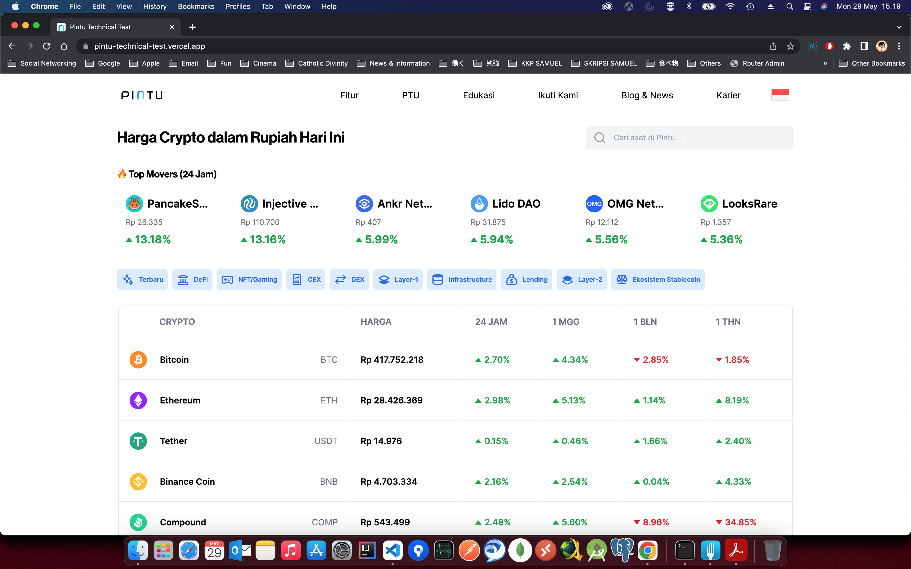
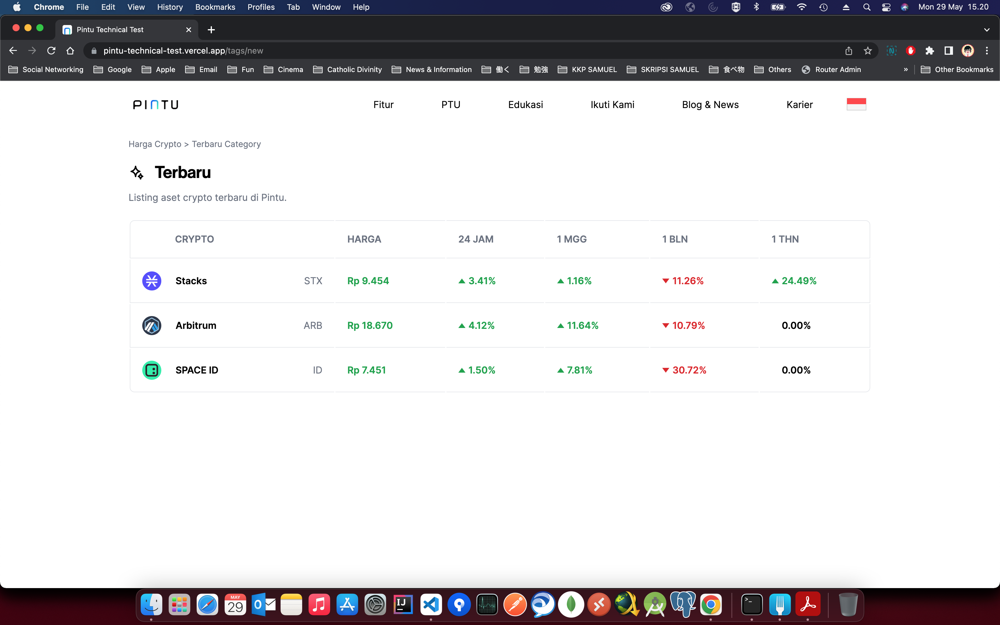
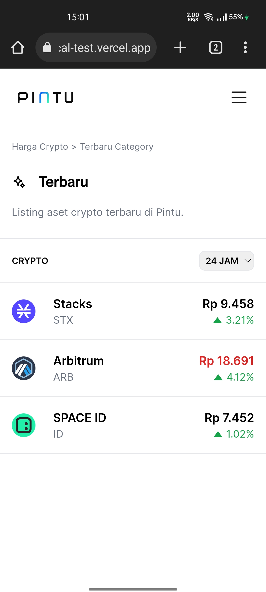

# Pintu Technical Test

This repository is a technical test for Pintu Job Application, created by **[Samuel Sonny Salim](https://www.linkedin.com/in/samuelsonnysalim/)**. Using Next.js as its techstack, it will fasten the web app development.

## Tech Consideration

I use Next.js 13 **App Router** for this project. Please click [here](https://nextjs.org/docs/app) to know more about **App Router**.
## Project Scope

The scope of this project is **[Market](https://pintu.co.id/market)** and **[Tags](https://pintu.co.id/market/tags/new)** page which have been replicated from Pintu website.

## How to start

1. After clone this repository, run:
   ```sh
   yarn
   ```

2. To perform unit test, run:
   ```sh
   yarn test
   ```

3. To start the project, run:
   ```sh
   yarn dev
   ```

4. It will be run on `http://localhost:3000`, to open the url, run:
   ```sh
   open http://localhost:3000
   ```

## Storybook

This repository contains Storybook implementation. Storybook is a catalog for components and pages. We can modify the props directly through Storybook.

To run Storybook, run:
```sh
yarn storybook
```

## Tech Stacks

### Core
- [Next.js](https://nextjs.org/)
- [TypeScript](https://www.typescriptlang.org/)
- [React](https://react.dev/)
- [Tailwind CSS](https://tailwindcss.com/)

### UI Related
- [Headless UI](https://headlessui.com/)
- [React SVG](https://www.npmjs.com/package/react-svg)

### API Call
- [React Query](https://tanstack.com/query/latest)
- [Axios](https://axios-http.com/docs/intro)

### Utilities
- [Classnames](https://www.npmjs.com/package/classnames)
- [CSS Mediaquery](https://www.npmjs.com/package/css-mediaquery)
- [Currency Formatter](https://www.npmjs.com/package/currency-formatter)
- [Path Parser](https://www.npmjs.com/package/path-parser)

### Unit Testing
- [Testing Library](https://testing-library.com/)
- [Jest](https://jestjs.io/)
- [TS-Jest](https://www.npmjs.com/package/ts-jest)
- [Nock](https://www.npmjs.com/package/nock)

### Linter
- [Eslint](https://eslint.org/)
- [Prettier](https://prettier.io/)

### Components Display Tool
- [Storybook](https://storybook.js.org/)


## Test Result

```
 PASS  src/app/component/__tests__/search-currency.test.tsx
  SearchCurrency
    ✓ should load component (91 ms)
    ✓ should open search input panel, focus on search input, and supported currencies on click (312 ms)
    ✓ should open search input panel, focus on search input, and supported currencies on click on mobile layout (60 ms)
    ✓ should disable scroll on body while opening search currency on mobile layout (65 ms)
    ✓ should close search input panel on clicking close button (132 ms)
    ✓ should close search input panel on clicking outside the component (72 ms)
    ✓ should clear search input value on reopen (336 ms)
    ✓ should enable scroll on body while closing search currency on mobile layout (273 ms)
    ✓ should call supported currencies api (5 ms)
    ✓ should render supported currencies based on api (34 ms)
    ✓ should filter supported currencies by name based on search input (198 ms)
    ✓ should filter supported currencies by currency symbol based on search input (106 ms)
    ✓ should not found panel if the searched item doesn't exist (95 ms)

 PASS  src/app/component/__tests__/menu.test.tsx (5.135 s)
  Menu
    ✓ should render component (306 ms)
    ✓ should show submenu on hover (629 ms)
    ✓ should render component on mobile layout (28 ms)
    ✓ should open menu on clicking menu icon on mobile layout (185 ms)
    ✓ should close menu on clicking close icon on mobile layout (205 ms)
    ✓ should disable scroll on body while opening menu on mobile layout (49 ms)
    ✓ should enable scroll on body while closing menu on mobile layout (178 ms)
    ✓ should toggle click submenu on mobile layout (737 ms)

 PASS  src/app/tags/[slug]/__tests__/page.test.tsx
  Tags
    ✓ should call market tags api (51 ms)
    ✓ should render Breadcrumb (90 ms)
    ✓ should render page title and subtitle (26 ms)
    ✓ should render PriceTable (298 ms)

 PASS  src/app/__tests__/page.test.tsx
  Home
    ✓ should load component (42 ms)
    ✓ should render SearchCurrency (92 ms)
    ✓ should render TopMovers (315 ms)
    ✓ should render MarketTags (150 ms)
    ✓ should render PriceTable (293 ms)

 PASS  src/app/component/__tests__/market-tags.test.tsx
  MarketTags
    ✓ should call market tags api (31 ms)
    ✓ should render market tags with link (64 ms)

 PASS  src/app/component/__tests__/price-table.test.tsx (7.964 s)
  PriceTable
    ✓ should load component (181 ms)
    ✓ should call supported currencies and price changes api (148 ms)
    ✓ should render price changes table (620 ms)
    ✓ should render price changes table on mobile layout (143 ms)
    ✓ should be able to select date range to "24 JAM" and render percentage based on it on mobile layout (241 ms)
    ✓ should be able to select date range to "1 MGG" and render percentage based on it on mobile layout (1126 ms)
    ✓ should be able to select date range to "1 BLN" and render percentage based on it on mobile layout (1078 ms)
    ✓ should be able to select date range to "1 THN" and render percentage based on it on mobile layout (1061 ms)
    ✓ should render price changes table with auto refetch (94 ms)
    ✓ should render price changes table based on currencies passed to the props (127 ms)

 PASS  src/app/component/__tests__/top-movers.test.tsx
  TopMovers
    ✓ should render 6 top movers (491 ms)

 PASS  src/app/__tests__/layout.test.tsx
  RootLayout
    ✓ should load component (645 ms)

 PASS  src/app/component/__tests__/message.test.tsx
  Message
    ✓ should load component (60 ms)
    ✓ should load component with title (5 ms)
    ✓ should load component with type error (18 ms)
    ✓ should load component with type success (3 ms)
    ✓ should load component with type warning (5 ms)
    ✓ should load component with type info (24 ms)

 PASS  src/app/component/__tests__/breadcrumb.test.tsx
  Breadcrumb
    ✓ should load component (50 ms)
    ✓ should render breadcrumbs based on paths passed to the props (44 ms)

 PASS  src/app/component/__tests__/percentage.test.tsx
  Percentage
    ✓ should load component (23 ms)
    ✓ should render value with green caret up for positive value greater than zero (4 ms)
    ✓ should render value with red caret down for negative value (22 ms)

 PASS  src/app/__tests__/client-provider.test.tsx
  ClientProvider
    ✓ should load component (32 ms)

 PASS  src/app/component/__tests__/currency.test.tsx
  Currency
    ✓ should load component (42 ms)
    ✓ should render value in currency formatted (5 ms)
    ✓ should render value with green text color after updated with greater than previous value (15 ms)
    ✓ should render value with red text color after updated with lower than previous value (14 ms)
    ✓ should disable render value with green text color after updated with greater than previous value if the "enableValueChangeIndicator" is false (4 ms)
    ✓ should disable render value with red text color after updated with lower than previous value if the "enableValueChangeIndicator" is false (5 ms)

----------------------|---------|----------|---------|---------|-------------------
File                  | % Stmts | % Branch | % Funcs | % Lines | Uncovered Line #s 
----------------------|---------|----------|---------|---------|-------------------
All files             |   99.16 |     92.5 |   98.33 |   99.14 |                   
 app                  |     100 |      100 |     100 |     100 |                   
  client-provider.tsx |     100 |      100 |     100 |     100 |                   
  layout.tsx          |     100 |      100 |     100 |     100 |                   
  page.tsx            |     100 |      100 |     100 |     100 |                   
 app/component        |   99.09 |     92.3 |   98.18 |   99.07 |                   
  breadcrumb.tsx      |     100 |      100 |     100 |     100 |                   
  currency.tsx        |     100 |      100 |     100 |     100 |                   
  loading.tsx         |     100 |      100 |     100 |     100 |                   
  market-tags.tsx     |     100 |      100 |     100 |     100 |                   
  menu.tsx            |   96.66 |      100 |    92.3 |   96.55 | 255               
  message.tsx         |     100 |    83.33 |     100 |     100 | 31                
  percentage.tsx      |     100 |      100 |     100 |     100 |                   
  price-table.tsx     |     100 |    83.33 |     100 |     100 | 44,104            
  search-currency.tsx |     100 |       90 |     100 |     100 | 107-108           
  top-movers.tsx      |     100 |       75 |     100 |     100 | 60                
 app/tags/[slug]      |     100 |      100 |     100 |     100 |                   
  page.tsx            |     100 |      100 |     100 |     100 |                   
----------------------|---------|----------|---------|---------|-------------------
Test Suites: 13 passed, 13 total
Tests:       62 passed, 62 total
Snapshots:   0 total
Time:        12.221 s
```

## Screenshots


Home Page - Desktop


Tags Page - Desktop


Home Page - Mobile


Tags Page - Mobile

## Demo

Demo is hosted by **[Vercel](https://vercel.com/)**, please look at the demo below:

- [Demo](https://pintu-technical-test.vercel.app/)
- [Storyboard](https://pintu-technical-test-storybook.vercel.app/)